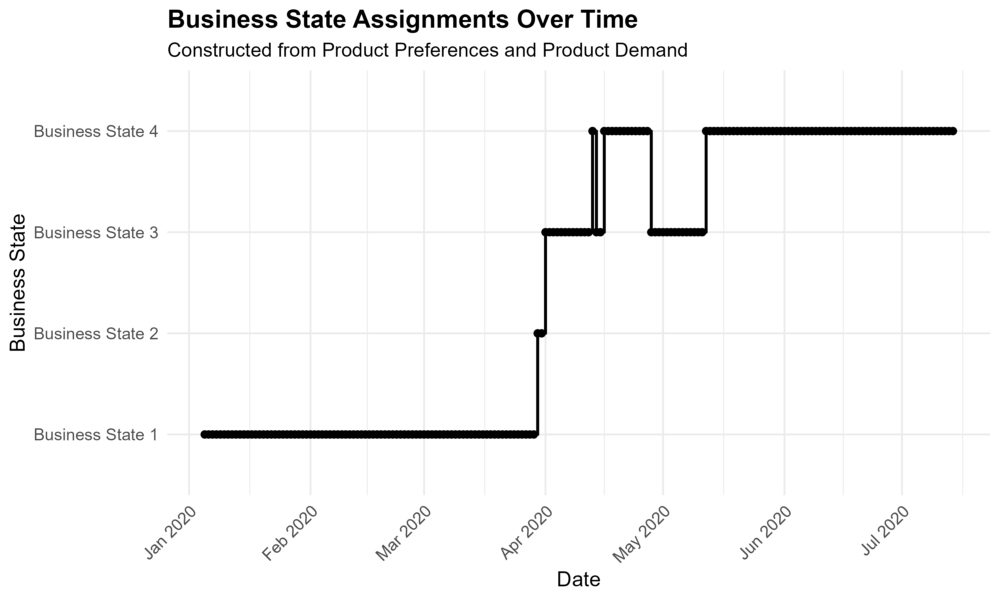
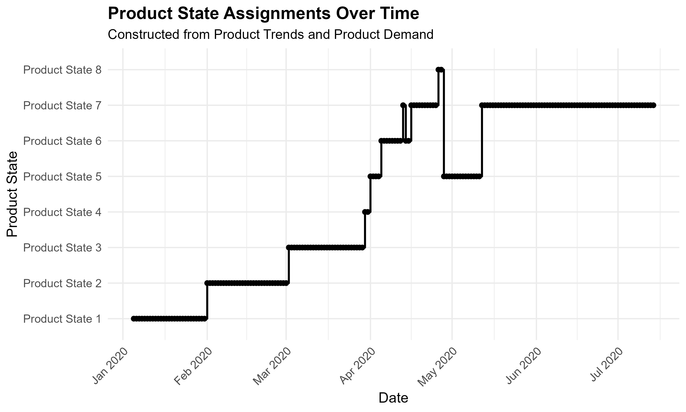
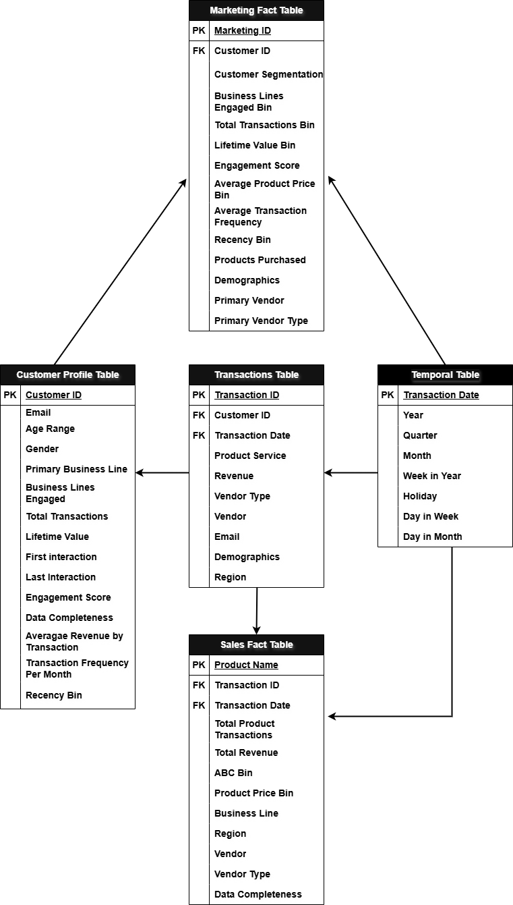

Data Analyst | Statistical Modeling & Business Analytics

## **About Me**
Data analyst with an M.S. in Statistics and Applied Mathematics and experience spanning organizational assessment, business operations, customer behavior, and product analytics. Skilled in translating stakeholder objectives into analytical frameworks, reporting solutions, and actionable insights from large-scale survey, operational, and transaction datasets. Experienced in leading cross-functional analytical projects and delivering data-driven recommendations that support strategic decision-making, operational improvement, and customer engagement.

**Resume:** [Download Resume](resume/Arturo_Molinar_Resume.pdf)

**LinkedIn:** www.linkedin.com/in/amolinariii

## Featured Work

- [Research Thesis](#featured-research-project)
- [MISSA Information Technology Competition](#cal-poly-pomona-missa-30th-annual-information-technology-competition--business-analytics)
- [Ontario International Airport CEO Business Challenge](#ontario-international-airport-ceo-business-challenge)
- [CRM Sales Performance Dashboard](#crm-sales-performance-dashboard)
---

## Featured Research Project
### Identifying Business States and Product States in Transaction Data

### Overview

Organizations often analyze customer demand, product performance, and purchasing behavior separately, making it difficult to understand how these factors interact over time. This research develops a state-based analytical framework that combines transaction volume and product purchasing patterns to identify recurring business conditions and product behavior states.

### Dataset

- 2M+ transactions analyzed
- 2,162 products
- E-commerce electronics retailer
- January 2020 – July 2020

### Methodology

- Developed a state-based analytical framework separating product composition from demand volume
- Identified product preference clusters using hierarchical clustering
- Partitioned product preference clusters into product trend clusters
- Identified demand clusters based on transaction volume
- Constructed business states and product states through cluster assignment intersections
- Applied sequence analysis to evaluate temporal state transitions

### Tools & Techniques

R • Hierarchical Clustering • Sequence Analysis • Statistical Modeling • Multivariate Analysis • Time Series Analysis

### Key Findings

- Identified 2 distinct product preference periods
- Identified 5 product trend clusters
- Identified 3 product demand clusters
- Constructed business states representing overall operational conditions
- Constructed product states representing detailed customer purchasing behavior

### Business Impact

The framework provides actionable insights for:

- Demand forecasting
- Inventory optimization
- Product performance monitoring
- Customer behavior analysis
- Marketing strategy development
- Operational planning

### Preview of Work

| Business States | Product States |
|----------------|----------------|
|  |  |

The resulting state assignments reveal recurring demand and purchasing patterns that can support inventory planning, demand forecasting, product management, and operational decision-making.

## **Projects**

### Customer Churn Factors and Prediction

**Overview**

Developed a customer churn prediction framework for a fitness center using statistical inference and machine learning techniques to identify factors associated with customer attrition. The project combined exploratory analysis, hypothesis testing, residual analysis, and regularized logistic regression to understand churn behavior and develop predictive retention strategies.

**Objective**

Identify the factors that influence customer churn, quantify their impact on retention, and develop a predictive model capable of identifying customers at risk of cancellation before they disengage.

**Dataset**

* 4,000 customer records
* 14 variables
* Fitness center membership data
* Customer demographics, engagement, contract information, and service utilization metrics

**Methodology**

* Performed exploratory data analysis on customer demographics, engagement metrics, and membership characteristics
* Applied G-tests of homogeneity to evaluate differences between churn and retained customer groups
* Conducted residual analysis to identify specific customer segments associated with retention and churn
* Engineered new features, including attendance-based behavior metrics such as Class Deviance
* Developed logistic regression models with Lasso and Ridge regularization
* Applied 5-fold cross-validation to optimize model performance and reduce overfitting
* Evaluated models using Accuracy, AUC, Sensitivity, and Specificity

**Tools & Techniques**

R • Logistic Regression • Lasso Regression • Ridge Regression • Cross Validation • Customer Segmentation • Hypothesis Testing • Residual Analysis • Predictive Analytics

**Key Findings**

* Customer engagement was a stronger predictor of retention than demographic characteristics
* Customers enrolled through promotional friend programs were significantly more likely to remain active
* Annual and semi-annual memberships demonstrated substantially higher retention rates than monthly memberships
* Customers who brought friends and regularly attended classes exhibited lower churn risk
* New and less-engaged members were significantly more likely to cancel their memberships
* The first 10 months of membership represented the highest-risk period for customer churn

**Predictive Modeling Results**

Three predictive models were evaluated using regularization techniques to balance model performance and interpretability.

| Model                    | Accuracy | AUC    | Sensitivity | Specificity |
| ------------------------ | -------- | ------ | ----------- | ----------- |
| Lasso                    | 93.74%   | 0.9753 | 0.9841      | 0.8082      |
| Ridge                    | 92.91%   | 0.9755 | 0.9807      | 0.7862      |
| Ridge (Excluding Gender) | 93.08%   | 0.9757 | 0.9807      | 0.7925      |

The Lasso model demonstrated the strongest overall performance while simultaneously reducing model complexity through feature selection, making it the preferred solution for operational deployment.

**Business Value**

The resulting model enables organizations to proactively identify customers at risk of cancellation and implement targeted retention strategies before churn occurs. Recommendations focused on increasing customer engagement, encouraging social participation, promoting longer contract commitments, and deploying personalized outreach campaigns based on behavioral risk indicators.

### Key Findings

### Presentation

[View Full Presentation](Projects/Customer Churn Factors and Prediction.pptx)

### Cal Poly Pomona MISSA 30th Annual Information Technology Competition – Business Analytics

**Overview**

Developed a business analytics and data integration strategy for a global media and entertainment company seeking to better understand customer behavior across streaming, merchandise, studio tours, theatrical releases, and retail partnerships. The project focused on addressing fragmented customer data and identifying customer journey patterns associated with long-term engagement and customer loyalty.

**Objective**

Design a scalable data integration framework that enables a unified view of customer behavior across first-party and third-party channels while identifying the customer journeys that drive higher engagement, retention, and customer lifetime value.

**Methodology**

* Evaluated customer interactions across multiple engagement channels
* Assessed data quality and customer identity resolution challenges across disparate systems
* Designed a centralized data warehouse architecture integrating first-party and third-party data sources
* Analyzed customer journey paths to distinguish loyal customers from one-time customers
* Developed recommendations for customer data integration, customer identification, and marketing optimization

**Key Insights**

* Identified customer journey tracks associated with long-term loyalty and repeat engagement
* Distinguished behavioral patterns between loyal and one-time customers
* Revealed data quality gaps that limited visibility into customer behavior across channels
* Demonstrated how integrating first-party and third-party data sources creates a more complete view of customer engagement and lifetime value
* Identified customer touchpoints associated with repeat engagement, brand loyalty, and higher customer lifetime value

**Tools & Techniques**

Data Warehousing • Customer Journey Analysis • Data Integration • Identity Resolution • Customer Segmentation • Business Analytics

**Business Value**

Provided a strategic roadmap for integrating customer data across channels, improving customer visibility, and enabling more effective customer analytics. Recommendations focused on strengthening customer retention, increasing brand engagement, improving marketing effectiveness, and supporting customer lifetime value analysis.

### Data Warehouse Architecture

The proposed architecture integrates first-party and third-party customer touchpoints into a centralized data warehouse to support unified customer profiles, customer journey analysis, and customer lifetime value reporting.

### Implementation Roadmap

A phased implementation strategy was developed to prioritize foundational data integration efforts, customer identity resolution, and long-term customer analytics capabilities.

### Presentation

[View Full Presentation](<Competitions/ITC Mathodicals 2026 (1)-compressed.pdf>)

### Ontario International Airport CEO Business Challenge

**Overview**

Developed a strategic analytics and revenue optimization plan for Ontario International Airport (ONT) focused on improving parking utilization, increasing non-aeronautical revenue, and preparing for future shifts in transportation and customer behavior. The project combined operational analysis, customer behavior insights, and technology recommendations to enhance both revenue generation and traveler experience.

**Objective**

Identify opportunities to improve parking utilization and revenue while adapting to long-term trends such as rideshare adoption, electric vehicles, digital convenience, and emerging mobility technologies.

**Methodology**

* Analyzed parking utilization, occupancy, and revenue trends across airport parking facilities
* Evaluated customer parking behaviors, transportation preferences, and rideshare adoption patterns
* Assessed underutilized parking assets and operational inefficiencies
* Examined customer experience challenges using utilization data and customer feedback
* Developed data-driven recommendations for pricing, service differentiation, technology integration, and infrastructure investments

**Key Insights**

* Identified utilization imbalances between premium and economy parking facilities
* Revealed opportunities to increase demand for underutilized parking lots through service improvements and pricing incentives
* Evaluated the growing impact of rideshare services on airport parking demand
* Identified customer experience pain points related to parking access, navigation, and shuttle services
* Highlighted opportunities to improve revenue through subscription parking plans, dynamic pricing, and customer loyalty programs

**Tools & Techniques**

Business Analytics • Customer Behavior Analysis • Revenue Optimization • Data Visualization • Strategic Planning

**Business Value**

Developed a phased roadmap for parking subscriptions, dynamic pricing, customer loyalty programs, shuttle optimization, EV charging infrastructure, and digital customer services. The recommendations were designed to increase parking utilization, improve customer satisfaction, expand revenue opportunities, and support the airport's long-term mobility strategy.

### Summary

Analysis of parking utilization, revenue trends, and customer transportation behaviors revealed opportunities to improve parking demand, increase revenue, and enhance the traveler experience. Key findings showed that parking utilization is heavily influenced by lot location, seasonal demand patterns, and the growing adoption of rideshare services. Underutilized parking assets, customer dissatisfaction with parking accessibility, and increasing demand for digital convenience highlighted areas for operational improvement.

Based on these findings, recommendations focused on parking subscriptions, dynamic pricing, shuttle optimization, enhanced wayfinding, customer loyalty programs, EV charging infrastructure, and digital customer services. A phased implementation roadmap was developed to improve parking utilization, strengthen customer engagement, and support Ontario International Airport's long-term mobility strategy.

**Presentation:** [View Full Presentation](<Competitions/ITC Mathodicals 2026 (1)-compressed.pdf>)

### **CRM Sales Performance Dashboard**

**Overview**

Developed an interactive sales performance dashboard using CRM data from a B2B computer hardware company to evaluate sales pipeline performance, account activity, product sales, and team effectiveness. The dashboard enables users to analyze won, lost, prospecting, and engaging opportunities across regions, sales teams, accounts, and products.

**Objective**

Provide leadership with a centralized reporting solution to monitor sales performance, identify high-performing products and sales teams, evaluate pipeline opportunities, and uncover trends in customer and account activity.

**Methodology**

* Imported CRM datasets from Excel into Microsoft SQL Server
* Cleaned, transformed, and joined multiple data sources into a centralized master table
* Queried SQL Server directly from Power BI
* Developed interactive dashboards with filters for region, month, and deal stage
* Created KPIs and visualizations to evaluate sales performance across products, accounts, and sales teams

**Key Insights**

* Compared sales performance across regions and sales teams
* Identified top-performing sales agents and accounts
* Evaluated product-level sales and units sold
* Tracked sales pipeline stages including won, lost, prospecting, and engaging opportunities
* Monitored sales trends over time to identify performance patterns

**Tools & Techniques**

Excel • Microsoft SQL Server • Power BI • Data Modeling • Dashboard Development

**Business Value**

The dashboard provides a centralized view of sales performance and pipeline activity, enabling stakeholders to evaluate team effectiveness, identify growth opportunities, monitor product performance, and support data-driven sales decisions.

Preview of Project:

---

## Professional Experience

### Data Analyst Assistant | Associated Students Inc. (Cal Poly Pomona)
- Collaborated with campus leadership to define assessment objectives, analyze survey data, and deliver insights that informed organizational planning and resource allocation.
- Developed Power BI dashboards and reporting solutions for senior leadership.
- Designed analytical frameworks that reduced project turnaround time by 3 weeks.

### Sales & Operations Assistant | Western Case Inc.
- Analyzed ERP data across 1,000+ customer accounts and 50+ products.
- Developed KPI dashboards and operational reporting solutions in Power BI.
- Supported sales, production, and resource planning through data-driven analysis.

## Technical Skills

**Programming & Data:** Python, R, SQL Server, BigQuery, Azure

**Analytics & Visualization:** Power BI, Tableau, Excel, Dedoose, Qualtrics

**Methods:** Statistical Modeling, Machine Learning, Time Series Analysis, Customer Segmentation, Survey Analysis, Forecasting, Data Warehousing

## Education

**Master of Science, Statistics and Applied Mathematics**  
California State Polytechnic University, Pomona

**Bachelor of Science, Applied Mathematics**  
University of California, Los Angeles

---
